<!-- <div align="center">


<br/>


<br/><br/>

[](https://iamsakthi.online)
[](https://www.linkedin.com/in/rsakthimurugesan/)
[](mailto:your-email@example.com)

<br/>


</div>

<br/>


## About Me

```yaml
name: Sakthi Murugesan
role: Frontend Developer × AI Enthusiast × Vibe Coder
focus:
  - Crafting pixel-perfect, high-performance UIs
  - Building full-stack MERN applications
  - Designing RAG pipelines & LLM-powered AI agents
  - Shipping fast with an AI-assisted "vibe coding" workflow
currently_exploring: "Agentic workflows, LLM orchestration, RAG optimization"
fun_fact: "I let AI pair-program with me, but the architecture is always mine."
```

<br/>


                                                  
<br/>

<br/>


## Let's Connect

<div align="center">

I'm always open to collaborating on **AI-powered products**, **frontend builds**, or **full-stack MERN projects**.

[](https://iamsakthi.online)
[](https://www.linkedin.com/in/rsakthimurugesan/)

<br/>


</div>


<br/>


 -->


<div align="center">



<br/>


<br/><br/>

[](https://iamsakthi.online)
[](https://www.linkedin.com/in/rsakthimurugesan/)
[](mailto:sakthicareer2001@gmail.com)

<br/>

</div>

<br/>

## About Me

```yaml
name: Sakthi Murugesan
role: Frontend Developer × AI Enthusiast × Vibe Coder
focus:
  - Crafting pixel-perfect, high-performance UIs
  - Building full-stack MERN applications
  - Designing RAG pipelines & LLM-powered AI agents
  - Shipping fast with an AI-assisted "vibe coding" workflow
currently_exploring: "Agentic workflows, LLM orchestration, RAG optimization"
fun_fact: "I let AI pair-program with me, but the architecture is always mine."
```

<br/>

                                                  
<br/>

<br/>

## Let's Connect

<div align="center">

I'm always open to collaborating on **AI-powered products**, **frontend builds**, or **full-stack MERN projects**.

[](https://iamsakthi.online)
[](https://www.linkedin.com/in/rsakthimurugesan/)

<br/>


</div>


<br/>
